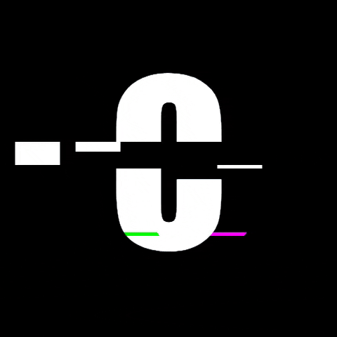

# Binary trees data structure with C!!



> [!WARNING]
> If you are just here to solve a specific task, Please try to understand the logic first. Kimda is close.

## What are binary trees and what its use?...

   - Binary tree is a tree-type non-linear data structure with a maximum of two children for each parent.

   - Binary trees can be used to store data in a database system, with each node representing a record.

## For the struct we are going to use, Please take a look at the following code.

  - Basic Binary tree:
    ```c
        struct binary_tree_s
        {
            int n;
            struct binary_tree_s *parent;
            struct binary_tree_s *left;
            struct binary_tree_s *right;
        };

        typedef struct binary_tree_s binary_tree_t;
    ```

  - Binary search Tree:
    ```c
        typedef struct binary_tree_s bst_t;
    ```

  - AVL Tree:
    ```c
        typedef struct binary_tree_s heap_t;
    ```

> [!NOTE]
> we will have to use each type of tree for its specified task. Include all of them inside your header file.
----------------------

## REQUIREMENTS:

   1. Add [This function](https://github.com/alx-tools/0x1C.c/blob/master/binary_tree_print.c) inside your code.

   2. This function is used only for visualization purposes. You don’t have to push it to your repo. It may not be used during the correction.

   3. Your header file name should be `binary_trees.h`.

   4. No global variables allowed.

   5. All the prototypes of your functions should be included inside your header file.

----

## All completed Tasks :

   - [x] 0. New node

   - [x] 1. Insert left

   - [x] 2. Insert right

   - [x] 3. Delete

   - [x] 4. Is leaf

   - [x] 5. Is root

   - [x] 6. Pre-order traversal

   - [ ] 7. In-order traversal

   - [ ] 8. Post-order traversal

   - [ ] 9. Height

   - [ ] 10. Depth

   - [ ] 11. Size

   - [ ] 12. Leaves

   - [ ] 13. Nodes

   - [ ] 14. Balance factor

   - [ ] 15. Is full

   - [ ] 16. Is perfect

   - [ ] 17. Sibling

   - [ ] 18. Uncle

-------

### :star_struck: HAPPY CODING :star_struck: !!...
